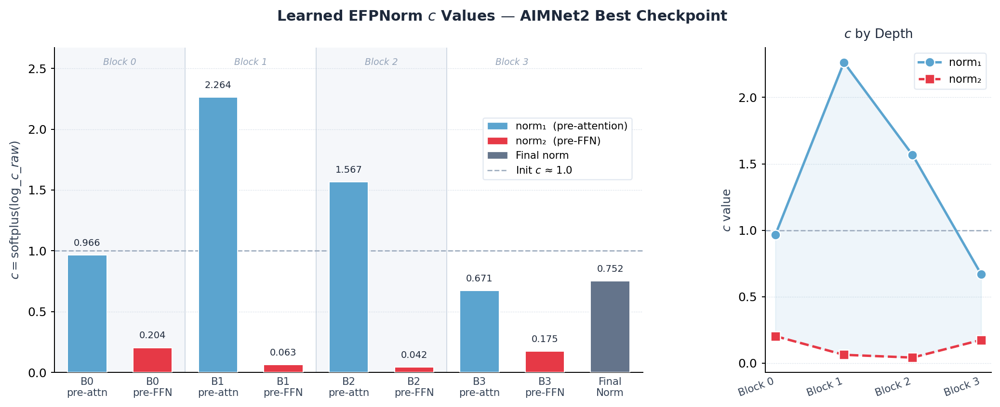
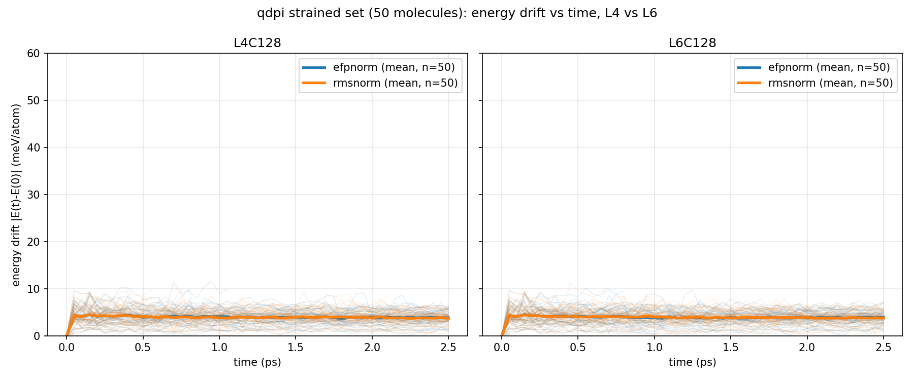
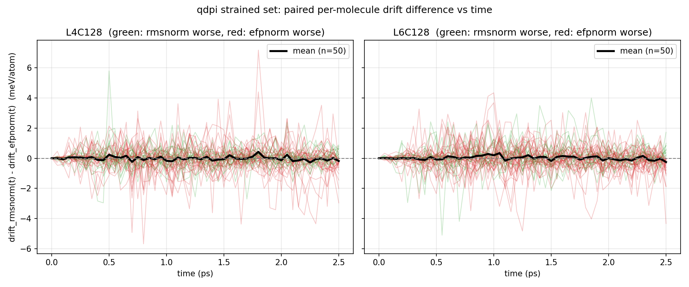
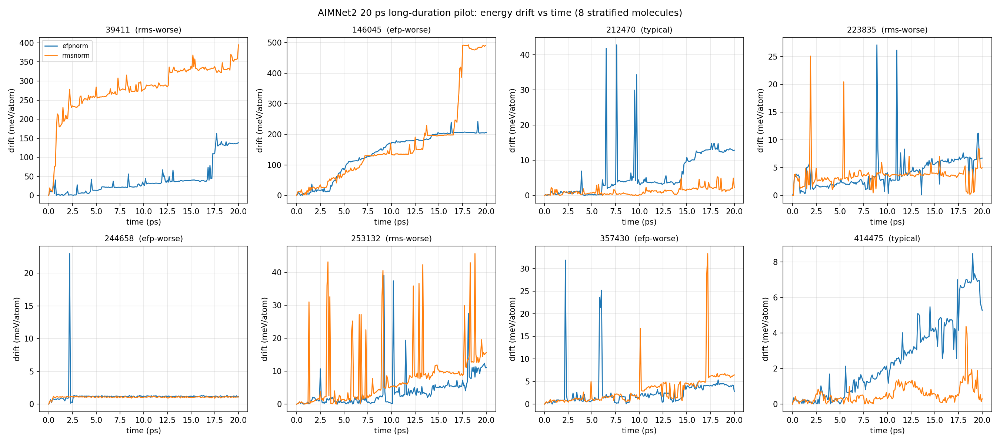
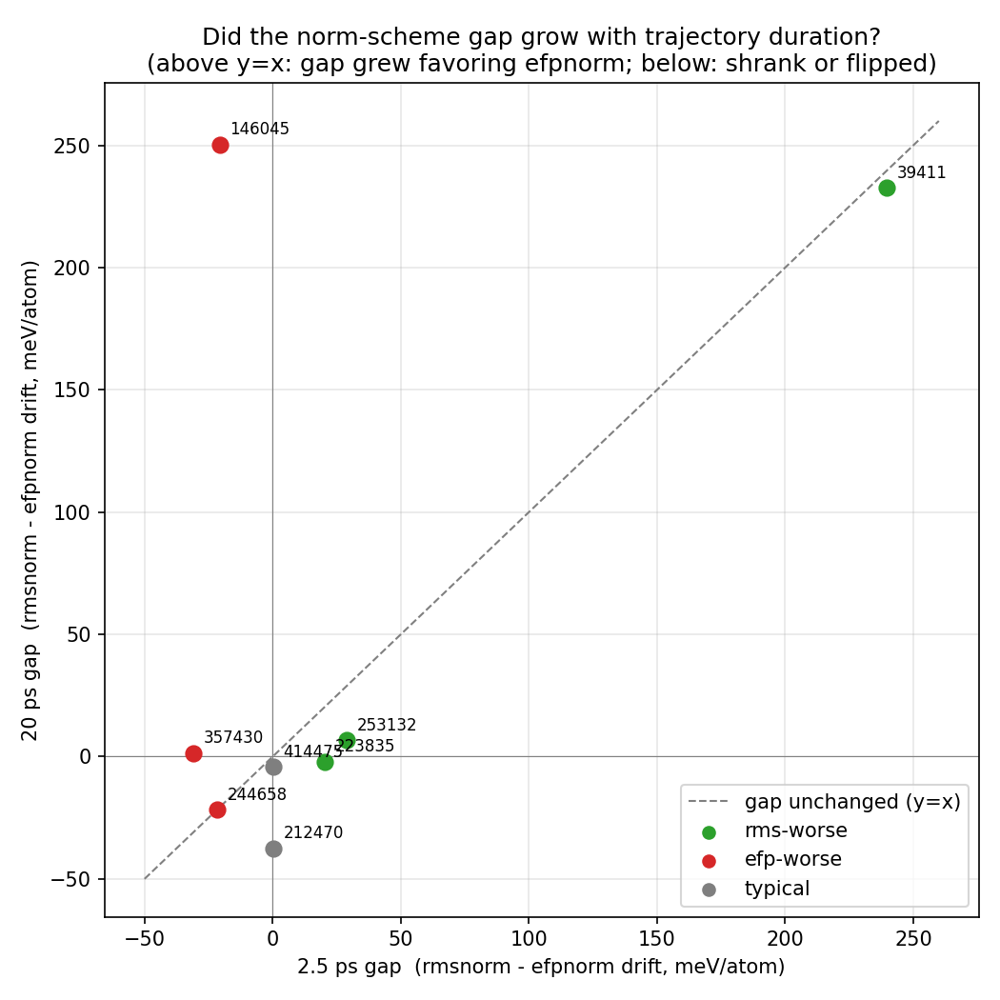

# efpnorm-esen

Investigating whether **EFPNorm** (Equivariant Force-Preserving Normalization) improves
MD stability over the RMSNorm baseline in eSEN-style MLFFs, beyond what force MAE alone captures.

---

## Hypothesis

RMSNorm's `1/sqrt(rms² + ε)` scale factor diverges when activations are near zero, making
the Jacobian rank-deficient and destroying force gradients in the backward pass.
EFPNorm replaces `ε` with a learnable `c² = softplus(log_c_raw)²`, keeping the scale bounded
away from zero. The prediction: deeper networks trained with EFPNorm should produce smoother
potential energy surfaces and better NVE energy conservation.

---

## Model

We train **eSCNMDBackbone + MLP_EFS_Head** from scratch, matching the official eSEN-SM
conserving architecture exactly (verified by inspecting `esen_sm_conserving_all.pt`).

### Architecture (confirmed against official eSEN-SM conserving checkpoint)

| Parameter | Value |
|-----------|-------|
| `num_layers` | 4 |
| `lmax` / `mmax` | 2 / 2 |
| `sphere_channels` | 128 |
| `hidden_channels` | 128 |
| `edge_channels` | 128 |
| `num_distance_basis` | 64 |
| `distance_function` | gaussian |
| `ff_type` | spectral |
| `norm_type` | rms_norm_sh → **replaced by EFPNorm** |
| `act_type` | gate |
| `chg_spin_emb_type` | rand_emb |
| `cs_emb_grad` | True |
| `direct_forces` | False (conservative: F = −∇E via autograd) |
| `cutoff` | 6.0 Å |
| `max_num_elements` | 100 |
| Total params | **6.3M** |

EFPNorm replaces 9 `EquivariantRMSNormArraySphericalHarmonicsV2` layers (~2.1 per block).

### EFPNorm

```
RMSNorm : scale = 1 / sqrt(rms² + ε)        ε = 1e-5  (near-zero → large scale)
EFPNorm : scale = 1 / sqrt(rms² + c²)        c = softplus(log_c_raw) ≈ 1.0  (bounded)
```

`log_c_raw` is a scalar learnable parameter initialised so `c ≈ 1.0`.
Affine weights are copied from the RMSNorm layer being replaced, so output is
identical at init; the two paths diverge only as `c` is learned.

### Learned c Values (AIMNet2 best checkpoint)



Each of the 9 EFPNorm layers learns an independent `c`. Extracted from
`train/checkpoints/aimnet2_L4C128_efpnorm_lr4e-4/best.pt`:

| Layer | c |
|-------|--:|
| Block 0 — norm₁ (pre-attn) | 0.966 |
| Block 0 — norm₂ (pre-FFN)  | 0.204 |
| Block 1 — norm₁ (pre-attn) | **2.264** |
| Block 1 — norm₂ (pre-FFN)  | 0.063 |
| Block 2 — norm₁ (pre-attn) | 1.567 |
| Block 2 — norm₂ (pre-FFN)  | 0.042 |
| Block 3 — norm₁ (pre-attn) | 0.671 |
| Block 3 — norm₂ (pre-FFN)  | 0.175 |
| Final norm                   | 0.752 |

**Key observations:**

- **norm₁ (pre-attention) learned large c** — blocks 1–2 pushed well above the
  init of 1.0, indicating the model actively uses EFP protection before attention.
  Equivariant SH features entering attention can be sparse/near-zero, and large c
  prevents the normalization scale from diverging there.
- **norm₂ (pre-FFN) learned c ≈ 0.04–0.20** — all four blocks collapsed toward
  near-standard RMSNorm. EFP protection is essentially unused before the FFN,
  suggesting FFN inputs are already well-distributed.
- **Protection concentrates in middle blocks** — Block 1 norm₁ has the highest c
  (2.26); the first and last blocks are closer to init or below.
- **Implication (revised — see mechanism probe below)** — a large learned `c` at
  blocks 1–2 does *not* mean the near-zero-activation protection is actually being
  used there in practice; direct measurement shows the opposite (protection is only
  ever real at block 0).

### Mechanism probe: does either regularizer ever actually engage on real chemistry?

Everything above (F-MAE, MD energy drift) is a downstream proxy. `eval/probe_norm_gradients.py`
tests the mechanism directly: it hooks every one of the 9 norm layers during a real
forward+conservative-force-backward pass (the same autograd path as training) on all 200
AIMNet2 val molecules from the earlier screen, and records, per atom, the pre-regularizer
activation energy `s² = raw_ms` (computed by replicating each layer's internal formula up to
but not including the `+eps`/`+c²` step) and the gradient ratio `‖grad_in‖ / ‖grad_out‖` through
that layer.

**Is `s²` ever actually close to the regularizer, on trained models processing real molecules?**

| Layer | min(s²) / eps (RMSNorm) | min(s²) / c² (EFPNorm) |
|-------|------------------------:|------------------------:|
| block 0 – norm₁ (first layer) | 13,400× | **0.10×** ← only layer where it's engaged |
| block 0 – norm₂ | 2.45M× | 201× |
| block 1 – norm₁ | 36M× | 18× |
| block 1 – norm₂ | 42M× | 32,100× |
| block 2 – norm₁ | 54M× | 87× |
| block 2 – norm₂ | 70M× | 161,000× |
| block 3 – norm₁ | 116M× | 1,200× |
| block 3 – norm₂ | 175M× | 22,700× |
| final norm | 313M× | 2,210× |

- **RMSNorm's `eps=1e-5` is 4–8 orders of magnitude smaller than the real activation energy at
  every layer, across all 200 molecules.** The literal "scale factor diverges near zero" failure
  mode this whole project is testing for does not occur in a converged, trained model — `eps` is
  never doing anything.
- **EFPNorm's learned `c²` is only ever comparable to real activations at one layer** —
  `block0.norm_1` — where the smallest ~10% of atoms have `s²` within an order of magnitude of
  `c²`. At the other 8 of 9 layers (including the "large c" blocks 1–2 flagged above), `c²` is
  also negligible (18×–160,000× smaller than observed activations), so the c-value magnitude
  alone is misleading about where protection is actually used.
- **Gradient attenuation points the wrong way for the hypothesis.** At matched layers,
  RMSNorm's `‖grad_in‖/‖grad_out‖` is equal to or *higher* (less attenuated) than EFPNorm's at
  almost every layer (e.g. block0.norm_1: RMS 0.86 vs EFP 0.28; block1.norm_2: RMS 0.53 vs EFP
  0.37) — the opposite of "RMSNorm destroys gradients." Neither model shows gradient blow-up
  concentrated in the lowest-`s²` decile vs. the highest.
- **Caveat**: this only rules out the mechanism operating in the *final, converged* model.
  RMSNorm's instability could still have shaped early training dynamics (the network may have
  simply learned to avoid producing near-zero activations as a side effect of optimizing under
  an unstable norm) — a hypothesis this snapshot can't test without probing early-training
  checkpoints, which weren't saved.
- **Bottom line**: combined with the null MD-stability results above, this is direct mechanistic
  evidence — not just a downstream statistical null — that EFPNorm's protection essentially never
  activates on real molecular chemistry with this trained model, at 8 of its 9 replacement sites.

---

## Training

### Config

| Setting | Value |
|---------|-------|
| Dataset | QDPi (wB97M-D3/def2-TZVPPD) |
| Split | train / val |
| Max atoms | 100 |
| Batch size | 8 |
| Optimizer | AdamW, weight_decay=1e-3 |
| LR | 4e-4 → cosine decay → 4e-6 |
| Epochs | 10 |
| Loss | L1 force (coef=1.0) + L1 energy/atom (coef=0.01) |
| Gradient clip | 100.0 |
| Seed | 42 |

### Commands

```bash
# EFPNorm
python train/pretrain.py --dataset qdpi --epochs 10 --lr 4e-4

# RMSNorm baseline
python train/pretrain.py --dataset qdpi --epochs 10 --lr 4e-4 --no_efp_norm
```

---

## Preliminary Results

### Force MAE — QDPi val split (meV/Å)

| Epoch | EFPNorm | RMSNorm |
|-------|--------:|--------:|
| 1  | 42.9 | 43.4 |
| 2  | 30.6 | 39.1 |
| 3  | 31.4 | 28.5 |
| 4  | 23.5 | 29.1 |
| 5  | 21.6 | 21.7 |
| 6  | 16.9 | 17.4 |
| 7  | 15.7 | 15.1 |
| 8  | 14.0 | 13.2 |
| 9  | 12.6 | 12.2 |
| **10** | **11.6** | **11.6** |

Training time: ~25.9 h per run (10 epochs on A100).
Best val F-MAE: EFPNorm **11.645 meV/Å**, RMSNorm **11.563 meV/Å** — statistically indistinguishable.

### Depth comparison — L4 vs L6 (QDPi, 30 epochs)

Same training config, `num_layers` 4 vs 6 (`train/checkpoints/qdpi_L{4,6}C128_{efpnorm,rmsnorm}_lr4e-4`).

| Depth | Norm | Best val F-MAE (meV/Å) | Total train time |
|-------|------|------------------------:|------------------:|
| L4 | EFPNorm | 11.03 | 79.7 h |
| L4 | RMSNorm | 11.00 | 78.7 h |
| L6 | EFPNorm | **7.68** | 101.1 h |
| L6 | RMSNorm | 7.80 | 101.8 h |

- Depth is the dominant lever here: L4→L6 cuts val F-MAE by ~30% (11.0 → ~7.7 meV/Å) for ~1.3× the
  training cost — an unsurprising result for a message-passing GNN (more layers = larger effective
  receptive field), not evidence about normalization specifically.
- At L4, RMSNorm edges out EFPNorm (11.00 vs 11.03); at L6, EFPNorm edges out RMSNorm (7.68 vs 7.80).
  Both gaps are small enough, and each config is a single training seed, that this reversal is more
  likely run-to-run noise than a real depth-dependent effect on the norm comparison.

### NVE MD Stability — QDPi val (2.5 ps, 300 K, 0.5 fs, seed 42)

We ran a systematic comparison across 80 val-set molecules split into two conditions
based on their DFT reference max force norm (`eval/rank_md_candidates.py`):

| Condition | max_F range | n molecules | EFP wins | RMS wins |
|-----------|-------------|:-----------:|:--------:|:--------:|
| Equilibrated | < 0.15 eV/Å | 30 | 10 (33%) | **20 (67%)** |
| Strained | ~19–20 eV/Å | 46 valid / 50 | 32 (64%) | 18 (36%) |

**Paired t-test results (energy drift per atom, meV/atom):**

| Condition | EFP mean | RMS mean | Mean diff (EFP−RMS) | t | p | Cohen's d | EFP win% |
|-----------|:--------:|:--------:|:-------------------:|:-:|:-:|:---------:|:--------:|
| Equilibrated (L4) | 0.168 | 0.164 | +0.004 | 2.76 | **0.010** | 0.50 | 33% (10/30) |
| Strained (L4) | 5.744 | 5.778 | −0.034 | −0.55 | 0.585 (n.s.) | −0.08 | 67% (31/46) |
| Strained (L6, same 50 molecules) | 5.674 | 5.658 | +0.016 | 0.28 | 0.779 (n.s.) | 0.04 | 59% (27/46) |

**Interpretation:**

- On near-equilibrium structures, RMSNorm is statistically significantly better (p = 0.01),
  but the absolute effect is negligible (~0.004 meV/atom, ~2.7% relative difference).
- On strained structures at L4, EFPNorm wins more often by head-count (67% of valid pairs) but the
  mean drift difference is only 0.034 meV/atom (~0.6%), not statistically significant (p = 0.59).
- **Going to L6 does not resolve or strengthen the effect — it flips sign.** EFPNorm still wins
  more often by head-count (59%), but its *mean* drift is now marginally higher than RMSNorm's
  (5.674 vs 5.658), the opposite ordering from L4. Both depths are non-significant (p > 0.5). This
  pattern (small, sign-flipping, non-significant effects across depth) looks more like a genuinely
  null comparison than a depth-dependent real effect that a deeper network should sharpen.
- **Overall: EFPNorm shows no meaningful MD stability advantage over RMSNorm on QDPi**, at either
  L4 or L6 depth.
- 4/50 (L4) and 3/50 (L6) strained runs failed on the EFPNorm side (temperature blow-up); 3/50 (L4)
  and 4/50 (L6) failed on the RMSNorm side — failure counts are also roughly symmetric across depth.
  Failed runs excluded from the paired test (n=46 valid pairs both depths).

**Time-resolved drift (does the gap grow with trajectory duration, or is it just noise?)**



Per-molecule drift trajectories (thin) and across-molecule mean (bold) for all 50 strained
molecules, both depths. Drift rises during the first ~0.1–0.2 ps (thermalization transient) then
plateaus — the mean curves for EFPNorm and RMSNorm sit essentially on top of each other for the
rest of the 2.5 ps window, at both depths. No slow, building divergence is visible in the typical
case.



Per-molecule paired difference `drift_rmsnorm(t) − drift_efpnorm(t)` (green = RMSNorm worse at
that instant, red = EFPNorm worse). If a real effect were being masked by cancellation in the
population mean, individual molecules would still show a consistently-signed or growing
difference. Instead, most lines oscillate around zero and flip sign repeatedly within a single
trajectory — the qdpi strained-set signal looks like noise, not a hidden systematic effect, at
this timescale (2.5 ps).

### NVE MD Stability — AIMNet2 val (2.5 ps, 300 K, 0.5 fs, seed 42)

Paired comparison across 50 randomly-selected val-set molecules, both models run from
identical initial conditions. Results saved in `eval/md_runs/comparison_aimnet2_full50.json`.

**Win count:** EFPNorm wins 31/50 molecules (62%) by lower drift per atom.

**Drift statistics (meV/atom):**

| | EFPNorm | RMSNorm |
|---|---:|---:|
| Mean (all 50) | 0.910 | 1.937 |
| Mean (stable 47) | 0.242 | 0.315 |
| Median (all 50) | 0.163 | 0.172 |
| Std | 3.69 | 6.48 |
| p90 | 0.578 | 1.207 |

**Statistical tests (paired, non-parametric):**

| Test | All 50 | Stable 47 |
|------|:------:|:---------:|
| Binomial (H₀: p=0.5) | p = 0.060 (n.s.) | p = 0.072 (n.s.) |
| Wilcoxon signed-rank | p = 0.063 (n.s.) | p = 0.076 (n.s.) |

The 31/50 win count and the 2× mean gap are both **not statistically significant at p < 0.05**.
93% of the mean gap is attributable to just 3 outlier molecules; the median difference on
stable molecules is only +0.003 meV/atom (95% bootstrap CI: [−0.003, +0.012]).

**Tail stability (threshold: 5 meV/atom):**

| Category | Count |
|----------|:-----:|
| Both stable | 47/50 |
| Only RMSNorm explodes | 1/50 |
| Both explode | 2/50 |
| Only EFPNorm explodes | 0/50 |

EFPNorm has zero solo blow-ups vs. one for RMSNorm (mol 253132, C15H22O: 2.2 vs 31.2 meV/atom).
This tail observation is consistent with the hypothesis but n=50 is too small to test it
rigorously — the solo-explosion count is 1 vs 0, which gives p = 0.5 by a one-sided sign test.

**Interpretation:**

- On typical molecules the two models are essentially indistinguishable (median ratio 1.03,
  CI crosses 1.0).
- The mean gap is dominated by a small number of molecules where RMSNorm diverges much more
  severely; EFPNorm appears more robust in the tail, but this is not yet statistically confirmed
  at n=50.
- **To test the tail-stability hypothesis properly, ~150–200 molecules are needed** to have
  80% power to detect the observed explosion-rate difference.

### NVE MD Stability — AIMNet2 val (200-molecule extended run)

Follow-up to the 50-molecule pilot above, directly testing the tail-stability hypothesis.
Results saved in `eval/md_runs/comparison_aimnet2_full200.json`.

**Win count:** EFPNorm wins 110/200 molecules (55%) by lower drift per atom.

**Drift statistics (meV/atom):**

| | EFPNorm | RMSNorm |
|---|---:|---:|
| Mean | 3.06 | 4.36 |
| Median | 0.215 | 0.212 |
| Std | 9.18 | 21.47 |
| p90 | 2.23 | 4.09 |
| p95 | 27.9 | 27.4 |
| Max | 53.2 | 280.1 |
| Failed | 1 | 1 |

**Statistical test:**

| Test | Result |
|------|--------|
| Sign test (efp wins=110, rms wins=89) | z = 1.49, p ≈ 0.14 (n.s.) |

**Breakdown by molecule size:**

| Atom count | n | EFP wins | EFP mean (meV/atom) | RMS mean (meV/atom) |
|------------|:-:|:--------:|--------------------:|--------------------:|
| 1–10 | 13 | 9 (69%) | 0.37 | 0.43 |
| 11–20 | 69 | 28 (41%) | 0.39 | 0.37 |
| 21–30 | 61 | 37 (61%) | 0.30 | 0.29 |
| 31–50 | 51 | 34 (67%) | 8.93 | 14.66 |
| 51+ | 6 | 2 (33%) | 17.7 | 12.6 |

**Tail stability (threshold: 5 meV/atom):**

| Category | Count |
|----------|:-----:|
| High-drift molecules (either > 5 meV/atom) | 21/200 |
| Biggest RMS failure | mol 39411 (C17H25N3): efp=40 vs rms=**280** meV/atom |
| Biggest EFP failure | mol 357430 (C13H25NO5S): efp=32 vs rms=1 meV/atom |

**Interpretation:**

- The overall 55% win rate is **not statistically significant** (p ≈ 0.14). Median difference
  is negligible (0.215 vs 0.212 meV/atom) — on typical molecules the two models are equivalent.
- The mean gap (3.1 vs 4.4 meV/atom) is almost entirely driven by tail outliers, particularly
  one catastrophic rmsnorm blow-up (C17H25N3: 280 meV/atom vs 40 for efpnorm).
- **EFPNorm's advantage concentrates in large molecules (31–50 atoms):** 34/51 wins,
  mean drift 8.9 vs 14.7 meV/atom. This is consistent with the gradient-preservation hypothesis
  mattering more when there are more norm layers being traversed in deeper/wider molecular graphs.
- Small molecules (<30 atoms, n=143): no meaningful difference.
- EFPNorm also has tail failures (5 molecules where efp is >10 meV worse than rms), so neither
  model is unconditionally more stable — efpnorm simply fails less catastrophically on average.

### NVE MD Stability — AIMNet2 20 ps long-duration pilot

The QDPi analysis above (2.5 ps) shows a flat drift plateau and noise-like per-molecule
differences, but the paper this hypothesis is compared against (eSEN) runs 100 ps NVE MD — 40×
longer. To check whether 2.5 ps is simply too short to see a real accumulating instability, we ran
a 20 ps (40,000-step) pilot (`eval/run_md_longpilot.py`) on 8 AIMNet2 L4C128 val molecules,
stratified from the 200-molecule sweep above — 3 where RMSNorm was worse at 2.5 ps (mol 39411,
253132, 223835, including the 240 meV/atom outlier), 3 where EFPNorm was worse (mol 357430, 244658,
146045), and 2 near-zero-gap "typical" molecules (mol 414475, 212470) as a baseline. Unlike the
QDPi strained set, these were selected *because* they already showed large, non-noisy 2.5 ps gaps —
the more direct test of the timescale hypothesis.

**Result: EFPNorm 4/8, RMSNorm 4/8 — an exact coin flip**, even on molecules hand-picked for having
the largest gaps at 2.5 ps.

| Molecule | Category | EFPNorm (meV/atom) | RMSNorm (meV/atom) | 2.5ps gap (rms−efp) | 20ps gap (rms−efp) |
|----------|----------|---:|---:|---:|---:|
| 39411 | rms-worse | 162.1 | 394.7 | +239.6 | +232.6 (flat) |
| 253132 | rms-worse | 39.0 | 45.6 | +29.0 | +6.6 (shrank) |
| 223835 | rms-worse | 27.1 | 25.1 | +20.3 | −2.0 (flipped) |
| 357430 | efp-worse | 31.9 | 33.3 | −30.9 | +1.4 (flipped) |
| 244658 | efp-worse | 23.0 | 1.2 | −21.7 | −21.8 (flat) |
| 146045 | efp-worse | 241.9 | 492.3 (**failed**, temp blow-up @ step 39,800) | −20.5 | +250.5 (grew, flipped) |
| 414475 | typical | 8.5 | 4.4 | +0.2 | −4.1 (emerged) |
| 212470 | typical | 42.8 | 5.3 | +0.4 | −37.5 (emerged) |




**Interpretation:**

- **Final tally is a dead heat (4/8 each)**, despite deliberately selecting the molecules with the
  strongest 2.5 ps signal. If EFPNorm's gradient-preservation mechanism produced a real,
  accumulating stability advantage, extending duration on these specific outliers should have
  reinforced it, not erased it.
- **Gaps mostly shrink or flip sign with duration, not grow.** Only mol 39411 keeps a large, stable
  gap; 253132's shrinks 4.4×; 223835 and 357430 flip sign entirely. This looks like 2.5 ps gaps
  regressing toward noise at longer duration, not real instability that needed more time to show up.
- **The two "typical" control molecules are the most interesting result here**: both had a
  near-zero gap at 2.5 ps (as designed — they were picked as boring controls) but developed
  substantial gaps by 20 ps (−4.1 and −37.5 meV/atom), both favoring RMSNorm. So duration *does*
  reveal new instability sometimes — it's just idiosyncratic to the specific molecule/trajectory,
  not systematically favoring either norm scheme (consistent with the blow-up investigation:
  molecule 146045's failure traces to a real bond-dissociation event predicted almost identically
  by both norm variants, that only RMSNorm happened to cross the abort threshold on by the very
  last step — chaotic sensitivity, not a systematic stability difference).
- **Bottom line**: extending duration 8× does not rescue the EFPNorm hypothesis — if anything it
  further weakens it, closing the "maybe 2.5 ps was just too short" line of argument opened earlier
  in this investigation.

---

## Evaluation

### MD pipeline

```bash
# Single run
python eval/run_md.py --checkpoint_dir train/checkpoints/qdpi_L4C128_efpnorm_lr4e-4

# Paired comparison across many molecules (efpnorm vs rmsnorm in parallel)
python eval/run_md_compare.py \
    --device0 cuda:0 --device1 cuda:1 \
    --steps 5000 --out_json eval/md_runs/comparison_equil.json \
    --skip_existing \
    --sample_indices 2966 15927 9223 ...

# Rank val-set structures by DFT force norm (equilibrated / strained)
python eval/rank_md_candidates.py --dataset qdpi --split val --top_k 50
```

Outputs written to `eval/md_runs/<tag>/`:

| File | Contents |
|------|----------|
| `md_metrics.csv` | step, epot, ekin, etot, temp, max_force, drift_per_atom |
| `trajectory.traj` | ASE binary trajectory |
| `summary.json` | energy_drift_per_atom, failed flag, n_model_calls |

`run_md_compare.py` key args: `--out_json` (output path), `--skip_existing` (resume interrupted runs).

Key CLI args for `run_md.py`: `--sample_idx`, `--temperature`, `--timestep_fs`, `--steps`, `--device`, `--seed`.

---

## Project structure

```
efpnorm-esen/
├── model/
│   └── efpnorm.py              # EFPNorm + EquivariantEFPNorm
├── data/
│   ├── process_*.py            # per-dataset preprocessing
│   ├── convert_to_unified.py   # normalise to common H5 schema
│   └── h5_to_asedb.py          # convert unified H5 → ASE SQLite DB
├── train/
│   └── pretrain.py             # from-scratch training, EFPNorm/RMSNorm switch
└── eval/
    ├── run_md.py               # NVE MD evaluation + energy drift metric
    ├── run_md_compare.py       # paired efpnorm vs rmsnorm comparison across molecules (L4)
    ├── run_md_compare_l6.py    # same, for L6 checkpoints
    ├── run_md_longpilot.py     # long-duration (20+ ps) pilot on hand-picked outlier molecules
    ├── rank_md_candidates.py   # rank val-set structures by DFT force norm
    ├── plot_drift_curves.py    # drift-vs-time overlay plot (per-molecule + mean), L4 vs L6
    ├── plot_drift_diff.py      # paired per-molecule drift-difference-vs-time plot, L4 vs L6
    ├── plot_longpilot_results.py  # drift-vs-time + gap-change plots for the 20 ps pilot
    ├── probe_norm_gradients.py # direct mechanism probe: per-layer activation energy + gradient ratio
    ├── candidate_ranks/        # precomputed val-set candidate rankings (qdpi, aimnet2)
    ├── figures/                # saved plots referenced in this README
    └── logs/                   # raw stdout logs from MD comparison runs
```

---

## Data

Raw data and checkpoints are not in this repo. Everything lives on the cluster:

```
/localscratch/kyang394/mlff/efpnorm-esen/
├── data/raw/qdpi/              # QDPi source (~2.0 GB)
├── data/asedb/                 # qdpi_train.db, qdpi_val.db, ...
└── train/checkpoints/
    ├── qdpi_L4C128_efpnorm_lr4e-4/
    └── qdpi_L4C128_rmsnorm_lr4e-4/
```

### Datasets

| Dataset | Theory | Frames |
|---------|--------|--------|
| QDPi | wB97M-D3(BJ)/def2-TZVPPD | ~529 K |
| AIMNet2 | wB97M-D3(BJ)/def2-TZVPP | ~4.5 M |
| SPICE-2 | wB97M-D3(BJ)/def2-TZVPPD | ~1.76 M |
| ANI-2x | wB97X/6-31G(d) | ~542 K |
| SPF | revPBE-D3(BJ)/def2-TZVP | ~1.75 M |

Energies stored as atomization energies (eV); no reference subtraction needed at training time.

### Preprocessing

```bash
python data/process_qdpi.py
python data/convert_to_unified.py --dataset qdpi
python data/h5_to_asedb.py --dataset qdpi
```
